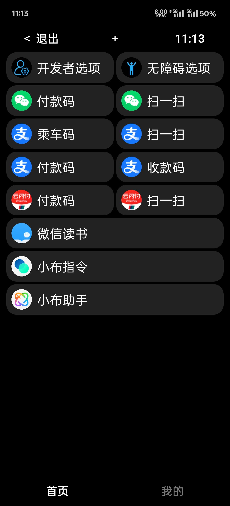
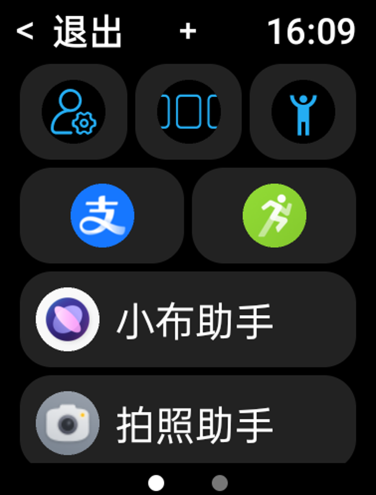

Copyright (c) 2024-2025 minimote(微尘). All rights reserved.
本项目遵循 MIT 许可协议，请务必保留此声明和署名。

# 安卓 APP - 工具箱

## 介绍

&emsp;&emsp;一款专为安卓手表设计的 APP，**最低支持安卓 8**，主要适配方形表盘，**同时支持手机使用**。

|                   手机版                   |                   手表版                   |
| :-----------------------------------------: | :-----------------------------------------: |
|  |  |

&emsp;&emsp;软件核心功能是将常用工具和应用集中管理，便于快速访问。用户可以将手电筒、支付宝收款码、最近任务等常用功能或软件添加到工具箱中，并且**支持自定义组件的顺序、大小和显示名称等**。由于手表通常只能通过按键快速启动一到两个应用，将本应用设为快速启动后，用户可以自由添加和调整常用应用，极大提升操作效率。

<!-- 后续会添加一些内置小工具，如木鱼，基于 WebView 的简易浏览器等。 -->

## [使用说明](instructions/使用说明.md)

## [更新日志](更新日志.md)

## 下载地址

- [Gitee【推荐】: https://gitee.com/minimote/toolbox/releases/latest](https://gitee.com/minimote/toolbox/releases/latest)
- [GitHub: https://github.com/minimote/toolbox/releases/latest](https://github.com/minimote/toolbox/releases/latest)

## 反馈问题或提出建议

- [Gitee【推荐】: https://gitee.com/minimote/toolbox/issues](https://gitee.com/minimote/toolbox/issues)
- [GitHub: https://github.com/minimote/toolbox/issues](https://github.com/minimote/toolbox/issues)

## TODO

- 整理 Theme 样式和字符串资源
- 组件显示文字和显示图标的问题
- 首页加搜索框？
- 状态栏显示秒
- 手持弹幕
- 功能：
  - scheme 启动工具
  - 组件高度设置(根据最小宽度调整？)
  - 添加自定义活动
  - 编辑组件页面的显示项调整
- 工具：
    - 系统时间显示秒
    - 清理后台
    - 手机手表互传文件(蓝牙、局域网)
    - 浏览器
    - 木鱼
    - 发送通知
- 待定：
  - 工具
    - 阅读电子书
    - 查看图片，动图，视频
    - 首页可放工具或文件夹
    - 可选页面切换样式
    - 手机手表联动功能
    - 更换本软件图标
    - 更换组件图标
    - 提取软件安装包
    - 导入导出配置
  - 美化
    - 工具图标
    - 优化 SeekBar 样式
    - 优化进度环样式

## 支持作者

&emsp;&emsp;如果觉得项目还不错，欢迎赞赏作者。

<!-- 

  

    
    
微信

  

  

    
    
支付宝

  

 -->

|                      微信                      |                      支付宝                      |
| :--------------------------------------------: | :----------------------------------------------: |
|  |  |

> 注：只接受成年朋友的打赏，如果你是未成年的朋友，欢迎你给项目点点 Star，和他人分享一下本项目，这就是对作者最大的支持。
