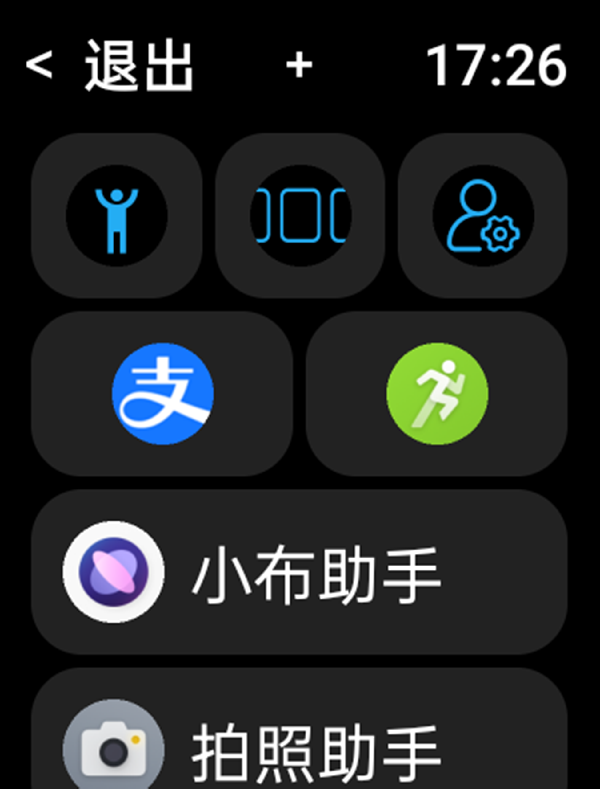
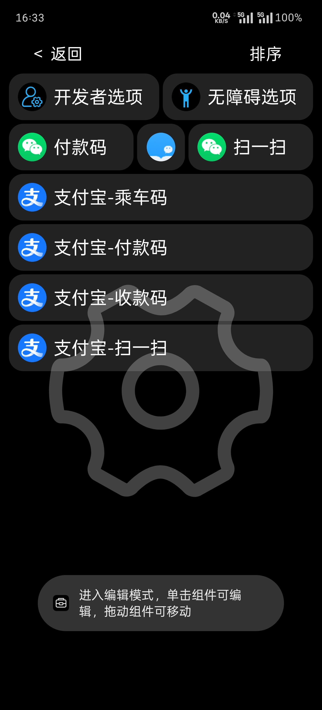
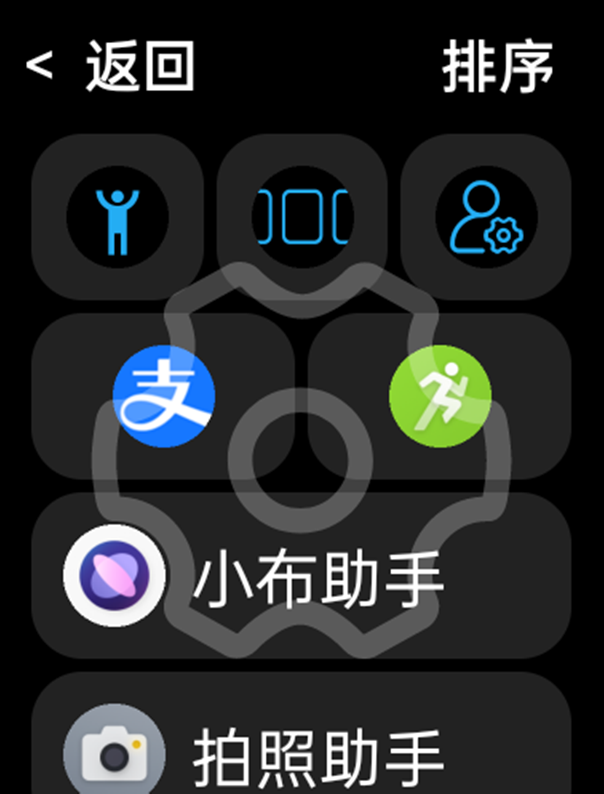
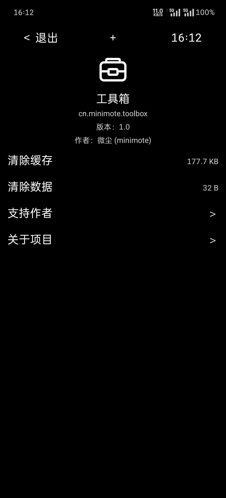
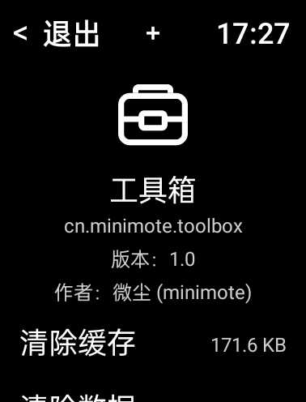
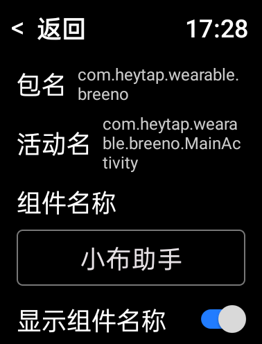
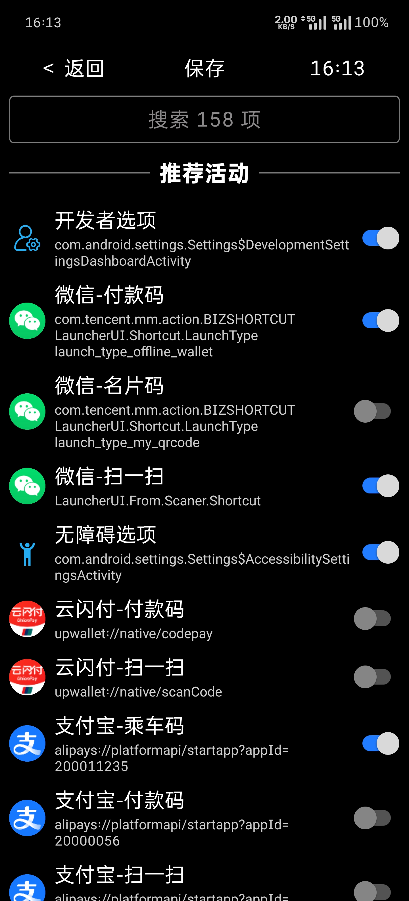
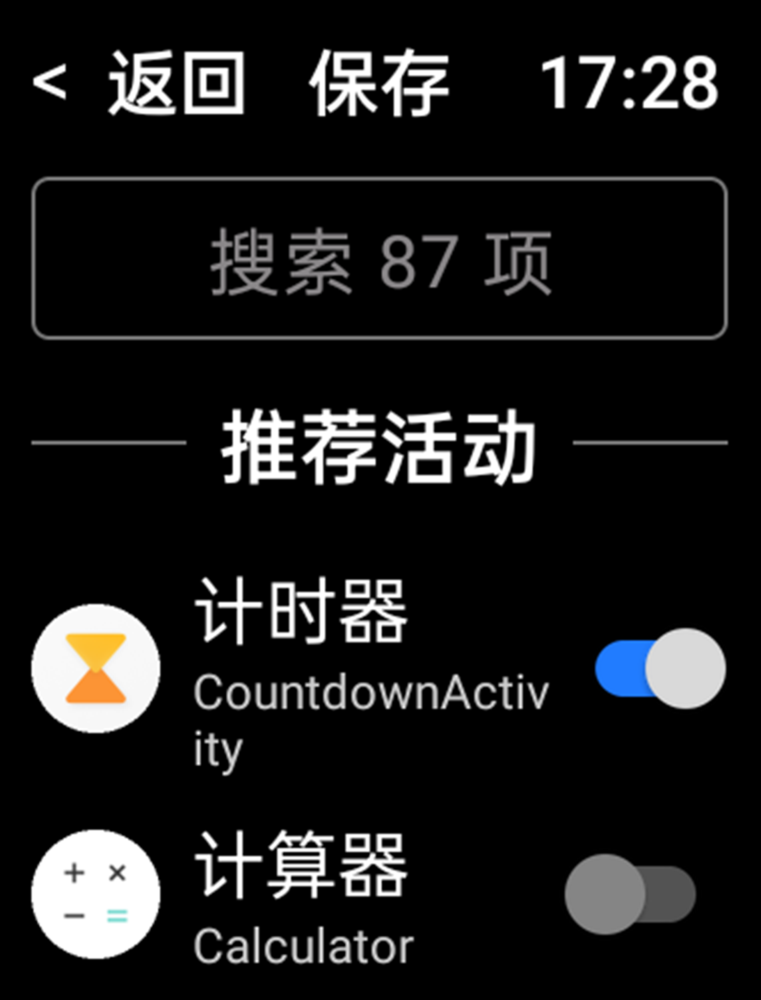

# 使用说明

&emsp;&emsp;该软件的一些特定功能和设备厂商相关，存在失效的可能，如跟随系统振动等。目前主要适配设备为欧加系（OPPO、一加、真我）手机和手表。

## 首页

&emsp;&emsp;软件启动后默认进入首页。点击页面顶部左侧的退出按钮可以退出软件，点击页面顶部中间的 ＋ 按钮可以进入活动列表添加组件，页面顶部右侧为当前时间的显示。单击小组件即可打开对应软件或活动。

| 首页-手机版 | 首页-手表版 |
|:-:|:-:|
|  |  |

> 注：本软件页面顶部左侧的退出按钮和返回按钮均可使用手机的系统返回手势或返回按钮达到相同的效果，下文将不再赘述。

&emsp;&emsp;长按首页小组件即可进入编辑模式。

| 编辑模式-手机版 | 编辑模式-手表版 |
|:-:|:-:|
|  |  |

&emsp;&emsp;在编辑模式下，长按可拖动小组件实现自定义排序，点击页面顶部右侧排序按钮可以按照系统规则排序。单击小组件可进入该小组件的编辑页面。

> 注：本软件的修改相关操作均需点击顶部的保存按钮才能使修改生效，下文将不再赘述。

## 我的页面

&emsp;&emsp;首页左滑即可进入我的页面。

| 我的页面-手机版 | 我的页面-手表版 |
|:-:|:-:|
|  |  |

- 顶部为应用相关信息。
- 清除缓存：点击可清除软件缓存。清除后需重新加载资源，可能会引起短暂卡顿，建议谨慎操作。
- 清除数据：点击可清除所有数据。清除后首页组件将全部删除，配置信息也将恢复默认，建议谨慎操作。
- 支持作者：点击进入赞赏页面，支持开发者。
- 关于项目：点击进入项目页面，可查看或跳转项目地址。

> 注：由于本软件与系统在计算缓存大小和数据大小的方法上存在差异，因此显示的缓存和数据大小可能与系统端显示的结果不一致。

## 编辑页面

&emsp;&emsp;首页长按小组件进入编辑模式，再单击小组件进入该小组件的编辑页面。

| 编辑页面-手机版 | 编辑页面-手表版 |
|:-:|:-:|
|  |  |

- 包名和活动名：长按可复制到剪贴板。
- 组件名称：小组件显示在主页的名称，可自由修改，也可为空。
- 显示组件名称：控制组件名称是否在主页显示，点击切换状态。。
- 组件宽度：设置组件在主页显示的宽度，范围 1-12，12 为整行宽度。点击 － 或 ＋ 可调整宽度。
- 删除与恢复：点击删除按钮移除组件，按钮变为恢复按钮。

> 注：如果点击删除后保存操作，再点击恢复按钮来恢复组件，此时该组件会被移到列表底部。

## 活动列表

&emsp;&emsp;在首页或我的页面点击页面顶部中间的 ＋ 按钮进入活动列表。

| 活动列表-手机版 | 活动列表-手表版 |
|:-:|:-:|
|  |  |

- 搜索功能：点击搜索框，输入软件名进行搜索。
- 推荐活动：列表前半部分是推荐活动，根据设备安装软件的情况来显示，推荐活动和系统相关，可能存在无法启动的情况。
- 其他活动：列表后半部分为设备中可被启动的软件或活动。
- 列表项：左侧为应用图标，中间上方为应用名称，下方为活动名或与启动相关的参数，右侧为是否在主页显示的开关，单击列表项可以切换开关状态。
